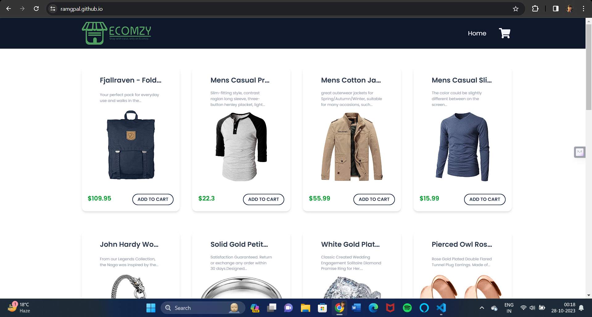
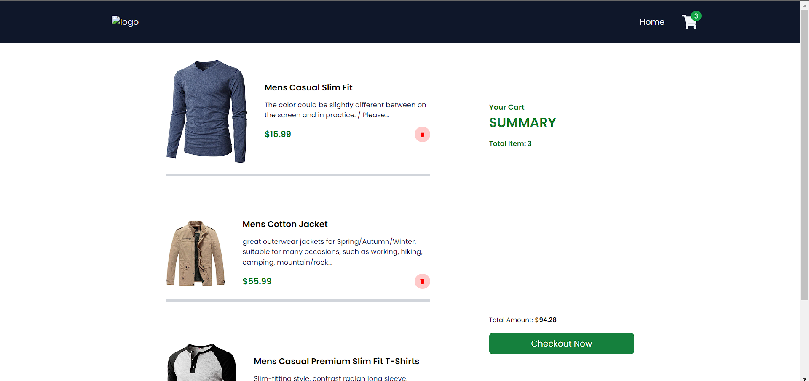

# ShoppingCartApp

*ShoppingCartApp* is a basic React application that showcases the implementation of Redux, an efficient state management library. With this app, you can add items to your cart, remove them, and seamlessly navigate through multiple pages for a user-friendly shopping experience.

## Features

- **Add Items**: Add your desired items to the shopping cart.
- **Remove Items**: Remove items from the cart with a simple click.
- **Shop Now**: Easily proceed to the shopping process.

## Homepage:



## Cartpage:



## Getting Started

Follow these instructions to get a copy of the project up and running on your local machine for development and testing purposes.

### Prerequisites

Before you begin, make sure you have the following software installed on your machine:

- [Node.js](https://nodejs.org/)
- [npm](https://www.npmjs.com/) (Node Package Manager)

### Installation

1. **Clone the Repository**:

   ```bash
   git clone https://github.com/ramgpal/ShoppingCartApp.git

2. **Install Dependencies:**

   1. npm install 
   2. npm install react-router-dom
   3. npm install react-icons

3. **Run the Application:**
    ```bash
    npm run start


